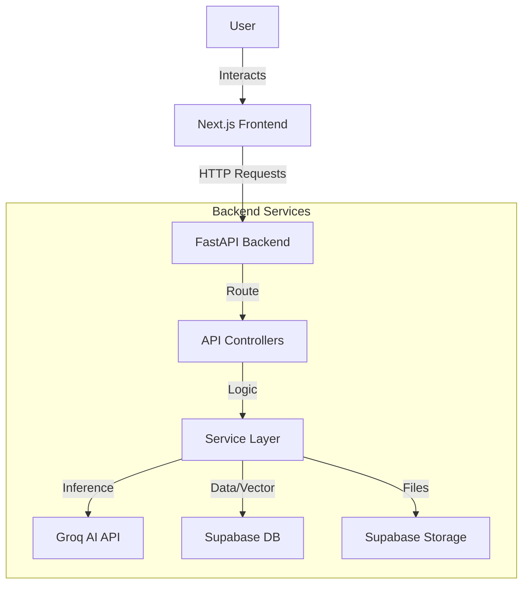
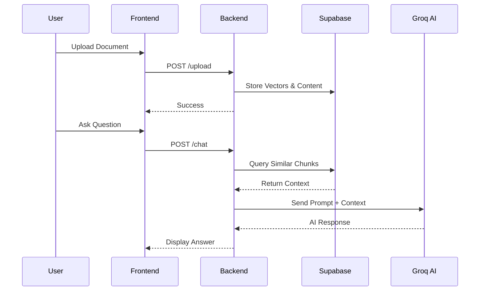

# Architecture Design

## System Overview

The **Conversational AI Education Platform** follows a modern decoupled architecture, separating the interactive Next.js frontend from the high-performance FastAPI backend.

### High-Level Data Flow

## Component Breakdown

### 1. Frontend (Next.js)
- **App Router**: Handles navigation.
- **Chat Interface**: Websocket-like experience using polling/REST.
- **File Upload**: Direct stream to backend.

### 2. Backend (FastAPI)
- **Service Layer**: 
    - `chat_service.py`: Retrieval Augmented Generation (RAG) logic.
    - `upload_service.py`: File parsing (PDF/Image), Chunking, and Embedding.
- **Database Layer**:
    - `vector_store.py`: Abstraction over Supabase `pgvector`.

## RAG Workflow (Retrieval Augmented Generation)

1. **Ingestion**: 
   - User uploads file -> Text extracted -> Chunked -> Embedded -> Stored in Supabase.
2. **Retrieval**:
   - User asks question -> Use current context + History -> Vector Search in Supabase -> Top K chunks retrieved.
3. **Generation**:
   - Prompt constructed with Context + History -> Sent to Groq (Llama 3) -> Response returned.

