# 🤖 Conversational AI Education Platform

> A futuristic educational platform featuring an AI chatbot with RAG capabilities, file uploads, and quizzes.


## 📚 DOCUMENTATION

We follow a systematic documentation approach.

### 1. [📐 ARCHITECTURE DESIGN](./ARCHITECTURE_DESIGN.md)
> **System Overview**: Next.js UI <-> FastAPI Backend <-> Supabase Vector Store & Groq AI.

```mermaid
graph TD
    User((👤 User)) -->|UI| Frontend[Next.js App]
    Frontend -->|HTTP| Backend[FastAPI Service]
    Backend <-->|SQL/Vector| DB[(Supabase)]
    Backend <-->|Inference| AI[Groq Llama 3]
```



### 2. [⚡ QUICK START](./QUICK_START.md)
**Backend**:
```bash
source backend/venv/bin/activate && pip install -r backend/requirements.txt
uvicorn src.main:app --app-dir backend --reload --port 8000
```
**Frontend**:
```bash
cd frontend && npm install
npm run dev
```

### 3. [✅ FEATURE INVENTORY](./FEATURE_INVENTORY.md)
- [x] **RAG Pipeline** (PDF/Text/Image Ingestion)
- [x] **AI Chat** (Context-aware Llama 3)
- [x] **Vision Analysis** (Image description via Llama 3.2)
- [ ] **Quiz Generation** (In Progress)

### 4. [🧪 TESTING GUIDE](./TESTING_GUIDE.md)
- **Health Check**: `http://localhost:8000`
- **Manual**: Upload PDF -> Ask Question -> Verify Context Usage.


## 🚀 OVERVIEW

The **Study Buddy** allows students to upload their study materials and interact with an AI that "knows" their documents.

### Key Features
-   **Chat with Data**: RAG system retrieves relevant context from uploaded files.
-   **Visual Intelligence**: Can analyze and describe uploaded images/diagrams.
-   **Modern Stack**: Built with Next.js 16, Tailwind 4, and FastAPI.
